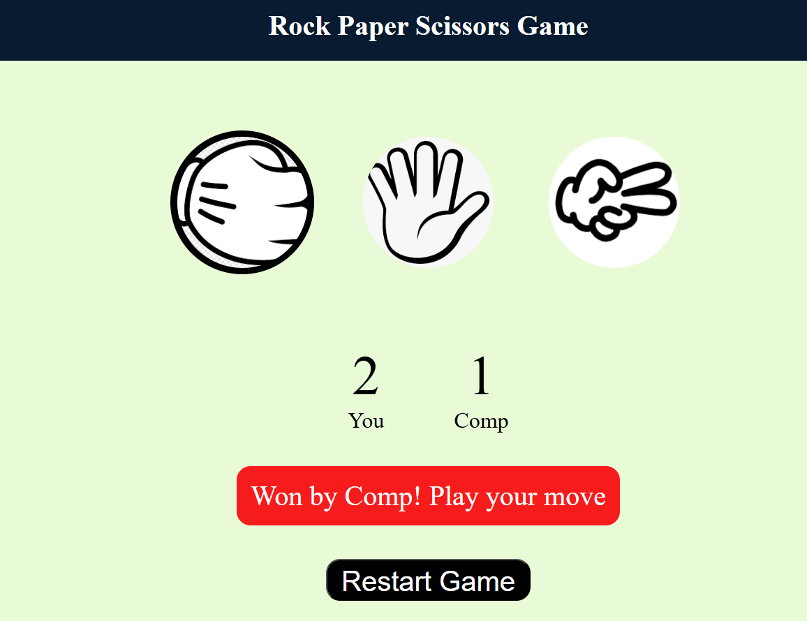
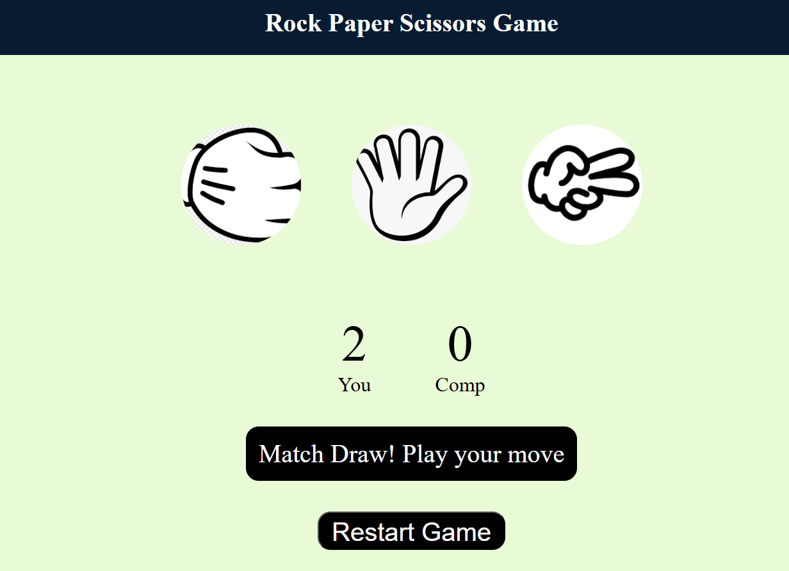
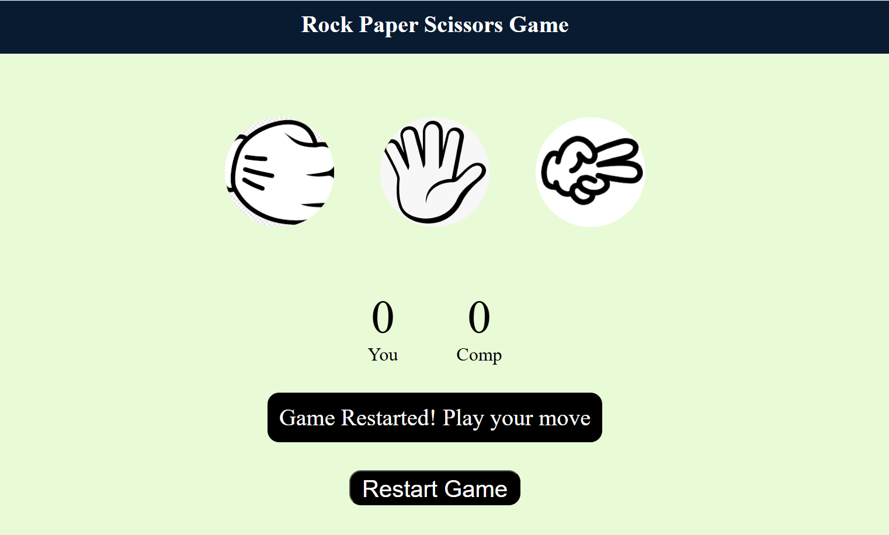
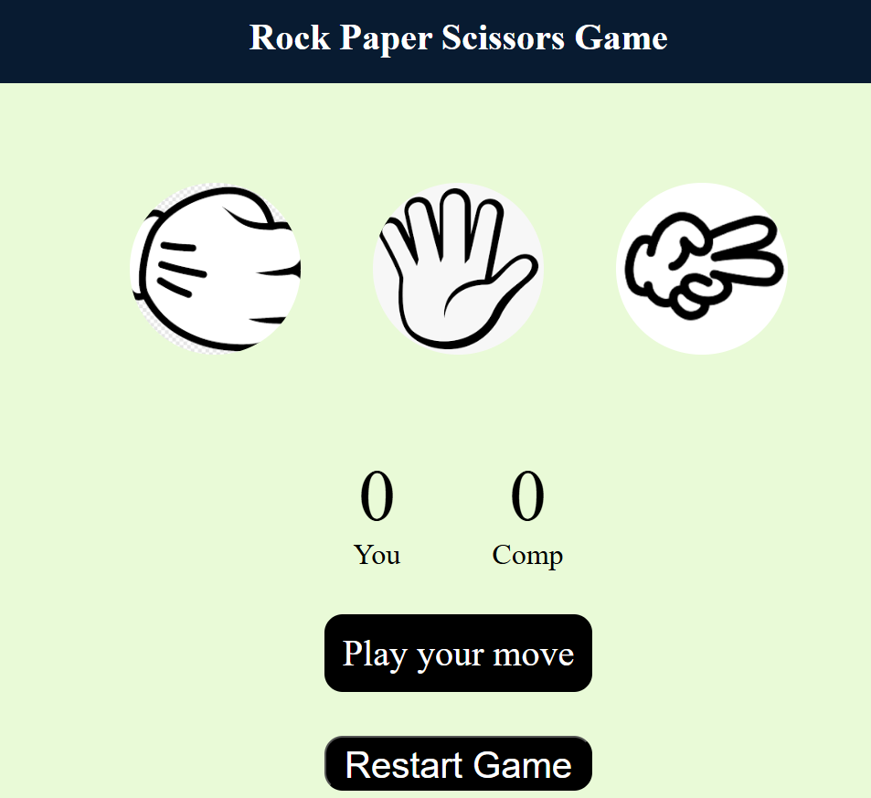

# 🎮 Rock Paper Scissors Game

A simple and interactive **Rock-Paper-Scissors** game built using **HTML, CSS, and JavaScript**. This game allows users to play against the computer with a live scoreboard and intuitive user feedback for wins, losses, and draws.

## 🖥️ Preview

| Player Wins | Computer Wins | Draw | Game Restarted | New Game |
|-------------|---------------|------|----------------|----------|
|  |  |  |  |  |

## 🚀 Features

- 🎮 User-friendly interface with clickable icons for Rock, Paper, and Scissors.
- 🤖 Computer makes random choices.
- 🧮 Real-time score tracking for both player and computer.
- 📣 Visual feedback for wins, losses, and draws.
- 🔄 Restart button to reset the game state.

## 🛠️ Technologies Used

- **HTML** – Markup for the game structure.
- **CSS** – Styling for the UI and hover effects.
- **JavaScript** – Game logic and dynamic DOM manipulation.

## 📁 Folder Structure

<pre>📦Project Root
├── 📂Previwe # Screenshots of the game
│ ├── computerwin.png
│ ├── draw.png
│ ├── newgame1.png
│ └── restarted.png
├── 📂imgs # Game images (rock, paper, scissors)
│ ├── rockimg.png
│ ├── paperimg.png
│ └── scissorsimg.png
├── index.html # Main HTML file
├── style.css # Styling for the game
└── app.js # Game logic


## 📸 How It Works

1. **Player clicks** on Rock, Paper, or Scissors.
2. **Computer randomly selects** its choice.
3. **Scores are updated** based on the winner:
   - Rock beats Scissors
   - Scissors beats Paper
   - Paper beats Rock
4. **Result message** is shown with a color indicator:
   - Green for player win
   - Red for computer win
   - Gray for draw
5. **Restart button** resets everything.

## 🧪 How to Run Locally

1. Clone or download the repository.
2. Open the folder in any IDE or text editor.
3. Open `index.html` in a browser.
4. Play the game!

```bash
git clone https://github.com/your-username/rock-paper-scissors-game.git
cd rock-paper-scissors-game
start index.html
